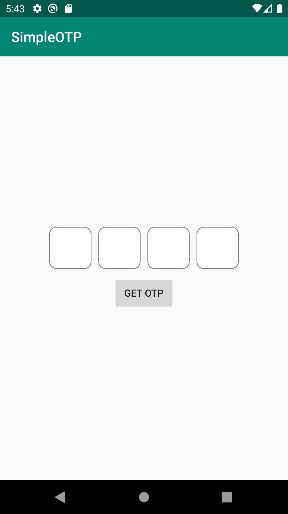

# SimpleOTP

## Introduction
Create OTP Screen Simply using SimpleOTP Library


## Import as dependency
Add in project level build.gradle
````css
allprojects {
	repositories {
		maven { url 'https://jitpack.io' }
	}
}
````

Add to application level build.gradle
````css
dependencies {
	implementation 'com.github.dhinakaransdk:SimpleOTP:1.0'
}
````

## Sample Code

#### layout xml
````
<in.dhinakaran.simpleotplibrary.SimpleOTP
  android:layout_width="match_parent"  
  android:layout_height="wrap_content"/>
````

#### Activity java class file code

`SimpleOTP simpleOTP;`

`simpleOTP = findViewById(R.id.otp_view);`

#### To get a Entered OTP
`simpleOTP.getOtp();`

## Screenshot



